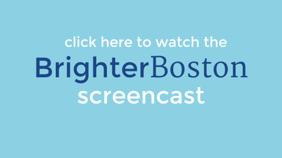

# [Brighter Boston](http://bright-lights.herokuapp.com/reports)

**Note: This screencast demos features available as of [this commit](https://github.com/lizvdk/LA-breakable-toy/tree/5f7b8b7f2f6cecadf85c46635d12fa7282367ae2).** A feature that allows users to upvote reports was implemented after this was recorded.

---
Brighter Boston is a web application where residents can submit municipal issues, including potholes and dim streetlights.
Brighter Boston is my 'Breakable Toy' (capstone project) for [Launch Academy](http://www.launchacademy.com/).

This app is based on The City of Boston's [Citizens Connect](https://mayors24.cityofboston.gov:4443/).

---

**This app is currently Under Construction.**

*More features and improvements are on the way!*

---

